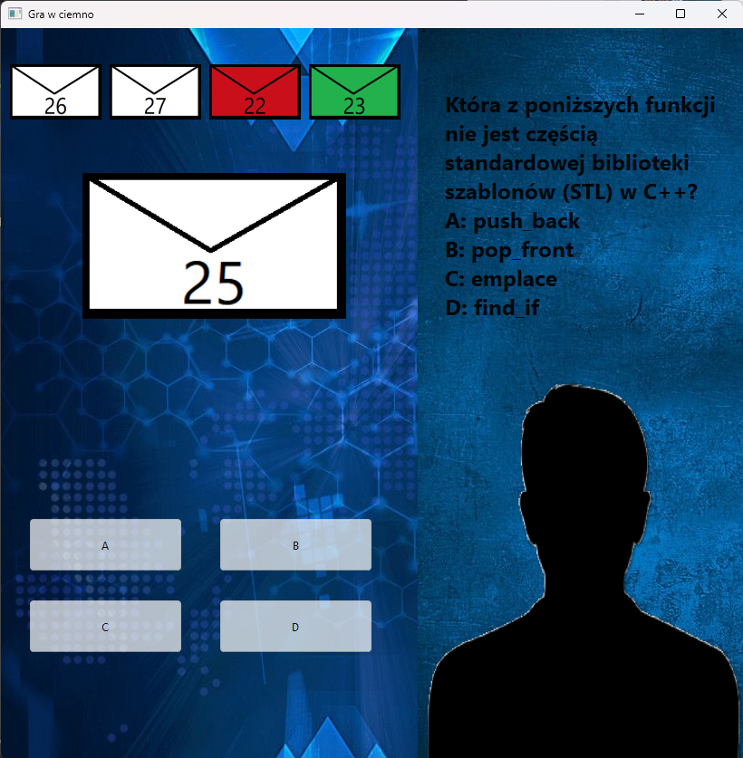
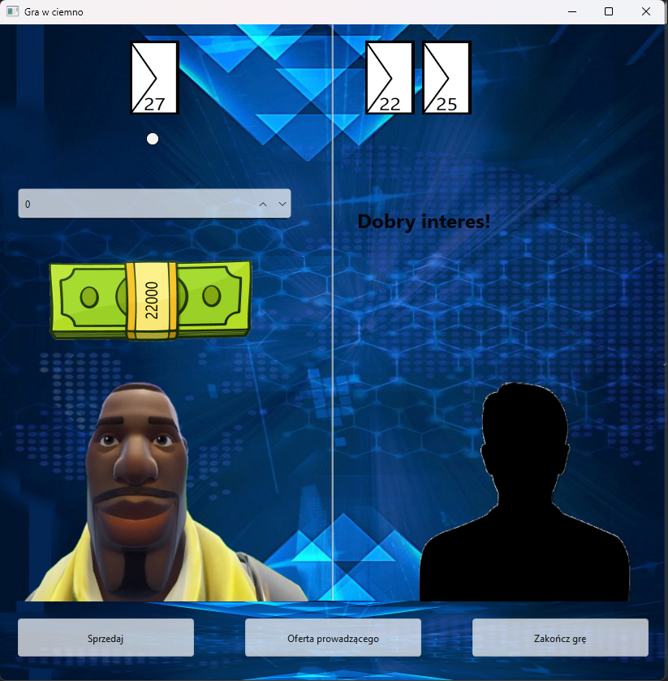

# Gra_w_ciemno_QT

## Authors: Norbert Dziwak, Mateusz Bobula

## Used library: Qt

# Example Gameplay

## 1. Choosing letters

## 2. Answearing questions

## 3. End of question faze

## 4. Trade offers

## 5. Winning screen

